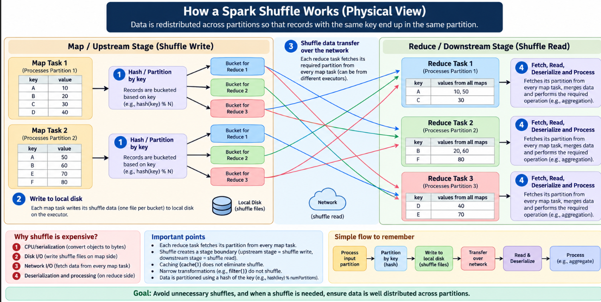

# Partitioning, Shuffling, Joins & Data Skew

# Partitioning

- In Spark, a partition is a chunk of data that is processed independently, and one task processes one partition in a particular stage. 
- When Spark reads data, the number of input partitions is mainly determined by the size of the source files and `spark.sql.files.maxPartitionBytes` (default ~128 MB).
- So, for example, 1 GB of input may result in roughly 8 input partitions (1024/128 = 8). Spark can also combine small files into partitions, so it is not necessarily one partition per file.
- When a transformation such as groupBy(), join(), or reduceByKey() causes a shuffle, Spark redistributes data across partitions, and the initial number of shuffle partitions is controlled by `spark.sql.shuffle.partitions` (default 200). - Therefore, you might have 8 tasks in the initial read stage and 200 shuffle partitions/tasks in the next stage.
- Too few shuffle partitions can create very large partitions and reduce parallelism, while too many can create many tiny partitions and increase overhead.
- With AQE (`spark.sql.adaptive.enabled=true`), Spark can examine the actual shuffle data at runtime and coalesce small partitions or otherwise adjust the execution plan, so the configured 200 is an initial/default setting rather than necessarily the final number of effective partitions.
- The key idea to remember is: input partitions are mainly driven by file splitting, shuffle partitions are initially driven by spark.sql.shuffle.partitions, and AQE can dynamically adjust post-shuffle partitioning.

## repartition (n) and coalesce(n)

repartition(n):
- Can increase or decrease partition count, and always trigger full shuffle. Since, evenly redistributing data across new count requires physically moving it. Its a wide transformation.

coalesce(n):
- can only decrease partition count, and avoids a full shuffle by simply merging existing partitions together without redistributing everything. Cheaper, but the trade-off is it can't balance data evenly — if your partitions are already lopsided, coalescing just merges the lopsidedness into fewer, still-lopsided partitions.

# Shuffle

- A shuffle means data has to move from its current partitions to new partitions, usually because Spark needs all records with the same key together.
- A Spark shuffle happens when data must be redistributed across partitions, such as during groupBy(), join(), or reduceByKey().
- On the map/upstream side, each task processes its partition, hashes/partitions records based on their keys, and writes the resulting shuffle data to local disk.
    - Why does Spark write to disk?
        - Because the downstream stage might not execute immediately on the same executor.
        - The shuffle data needs to be made available for downstream tasks.
        - So Spark produces shuffle files that downstream tasks can later fetch.
    - This creates major cost of shuffle -> Disk I/O
- On the reduce/downstream side, each task fetches its required data from the map tasks over the network, then reads, deserializes, merges, and processes it.
- Therefore, a shuffle is expensive because it involves multiple costs— CPU/serialization, disk I/O for shuffle writes, network I/O for shuffle reads, and deserialization/processing.
```text
CPU
 ↓
Serialization
 ↓
Disk I/O
 ↓
Network I/O
 ↓
Deserialization
 ↓
CPU

Serialization means converting objects/data into a format suitable for storage or transmission.
Spark objects
     ↓
Serialization
     ↓
Bytes
     ↓
Disk / Network
```
- A shuffle also creates a stage boundary: the upstream stage performs shuffle write, and the downstream stage performs shuffle read.
- Unlike a narrow transformation such as filter(), which processes each partition independently without moving data between partitions, a shuffle requires data redistribution.
- Calling .cache() does not eliminate a shuffle because caching and shuffling serve different purposes.
    - Caching means keep a DataFrame's computed partitions available for reuse.
    - Shuffle means Redistribute data between partitions
- The easiest way to remember it is: Process → Partition by key → Write to disk → Transfer over network → Read/Deserialize → Process.


# join strategy: broadcast join vs shuffle sort merge join

- When one side of the join is small enough (controlled by `spark.sql.autoBroadcastJoinThreshold`, default 10 MB), Spark can use a Broadcast Hash Join by sending a copy of the small DataFrame to every executor, allowing each executor to join its local partition of the large DataFrame using a hash lookup, without shuffling the large side.
- If neither side is small enough to broadcast, Spark generally uses a Shuffle Sort-Merge Join, where both DataFrames are shuffled based on the join key so matching keys land in the same partitions, then the partitions are sorted and merged locally.
- Shuffle involves disk I/O, network I/O, serialization/deserialization, and sorting, it is more expensive than a broadcast join.
- You can also explicitly request broadcast join:
```py
from pyspark.sql.functions import broadcast
big_df.join(broadcast(small_df), "key")

# "key" is the column on which you want to join the two DataFrames.
```
# Data Skew

- Data skew is an uneven distribution of data across Spark partitions, usually after a shuffle.
- For example, if most customers have a few orders but one customer has millions, a groupBy("customer_id") or join can send all records for that customer to the same partition because records with the same key must be colocated for correct processing. This creates a situation such as 199 tasks processing around 200 MB while one task processes 45 GB. That one task takes much longer, while the other executors finish and remain idle, making the entire stage wait for the slow task.
- Skew can be caused by dominant/hot keys, highly frequent values, or large numbers of NULL values.
- To diagnose it, use the Spark UI to compare task duration, shuffle-read size, shuffle-write size, input size, and spill, then investigate the data itself—for example, groupBy("customer_id").count().orderBy(...) can reveal unusually frequent keys.
- For fixing skew, **AQE (Adaptive Query Execution)** is usually worth trying first because Spark can detect oversized post-shuffle partitions at runtime and, for supported skewed operations such as joins, split them into smaller pieces.
- **Salting** is a manual technique where you add a random or deterministic suffix to a skewed key, such as turning C999 into C999_0, C999_1, etc., allowing the records to spread across multiple partitions; partial results must then be combined afterward.
- Another approach is to **isolate the problematic key**, process it separately with a tailored strategy, and then union the result with the normal data.
- The key decision is: confirm the skew first, identify the actual hot key, try AQE when appropriate, and use salting or separate processing when automatic handling isn't sufficient.

Example  — spotting and fixing skew.
You're aggregating revenue by customer_id, and the Spark UI shows one task taking 40 minutes while every other task in the stage finishes in 20 seconds. Investigating shows one customer_id — a bulk-order integrator — accounts for a huge share of all rows. Fix via salting:

```py
from pyspark.sql.functions import lit, floor, rand, concat

salted = df.withColumn('salted_key', concat(df.customer_id, lit("_"), floor(rand()*10)))

partial = salted.groupBy('salted_key', 'customer_id').sum('revenue')

final = partial.groupBy('customer_id').sum('sum(revenue)')
```

# Common misconceptions and mistakes

- "repartition and coalesce do the same thing, just with different names." No — repartition always shuffles and can go up or down; coalesce only goes down and typically skips the shuffle, at the cost of not rebalancing existing skew.
- "More shuffle.partitions is always safer." No — too many for the actual data size creates tiny partitions and scheduling overhead that can be worse than too few.
- "Broadcast join is always better if it's available." Nearly always faster, but the "small" side still has to fit comfortably in every executor's memory simultaneously with everything else running — broadcasting something too close to the threshold on a memory-constrained cluster can cause its own problems.
- "AQE makes manual tuning obsolete." It removes a lot of guesswork, but it reacts after a shuffle already happened — it can't prevent an unnecessary shuffle from being planned in the first place. Writing efficient logic still matters.

# Revision

- Partitioning: repartition (up or down, always shuffles) vs. coalesce (down only, usually avoids shuffle but can't fix skew).
- Shuffle mechanics: map side writes to local disk; reduce side fetches over the network from every map task — disk + network + serialization is why shuffles are expensive.
- Joins: broadcast (copy the small side everywhere, no shuffle) vs. shuffle/sort-merge (redistribute both sides by key) — controlled by `spark.sql.autoBroadcastJoinThreshold`
- Skew: uneven key distribution overloads one partition/task; fixed via salting or AQE's automatic skew-splitting.
- AQE: adjusts the plan using real post-shuffle statistics — coalesces partitions, splits skew, can switch join strategy at runtime. Default-on since Spark 3.2.

# Section 4 Questions

Question 1: In your own words, why does coalesce typically avoid a shuffle while repartition always triggers one — even when both are just changing the number of partitions?

Answer:
Coalesce's side, made precise: it merges a fixed, predetermined set of existing partitions into each new one — e.g., "new partition 1 = old partitions 1 and 2." That mapping is decided purely by partition index. Nobody needs to inspect a single row's contents or compute where it should go — so there's nothing that requires a network-wide, per-record redistribution.
Repartition's side : to guarantee an evenly balanced (or hash/key-based) distribution across a target count, Spark has to decide, for every individual record, which new partition it belongs in — typically via a hash function or round-robin — and then physically send each record wherever that computed destination lives. That per-record computed reassignment, moved across the network, is the definition of a shuffle. There's no way around it if balance is the guarantee being made.
repartition can increase partition count — splitting one partition's rows out into several — and that's simply impossible without redistributing records; there's no way to "split" data that's already sitting as one contiguous block without deciding where each piece goes. Since the same mechanism has to support both directions and guarantee balance, it always takes the shuffle path — even on a call that happens to be decreasing the count.

---

Question 2: Name the distinct costs that stack together to make a shuffle expensive, and explain why a narrow transformation like .filter() avoids all of them.

Answer:
A shuffle is expensive because of: Serialization, Network I/O, Disk I/O, Data Repartitioning, Sorting, Merging, CPU overhead. In  Narrow Transformation data stays where it is there no shuffle and hence avoids shuffles redistributing costs.

---

Question 3: You're joining a 2GB DataFrame against a 50MB DataFrame, and `spark.sql.autoBroadcastJoinThreshold` is set to its default (10MB). Will Spark auto-broadcast the 50MB side? And separately — even if it doesn't, is there anything you personally can still do about it?

Answer:
Spark will not automatically broadcast  the 50mb dataframe because 50mb>10mb. Spark will choose another join strategy involving shuffle.
Using broadcast hint I can tell spark to broadcast 50mb dataframe.

---

