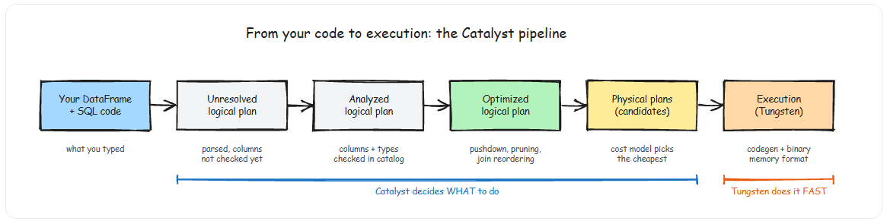
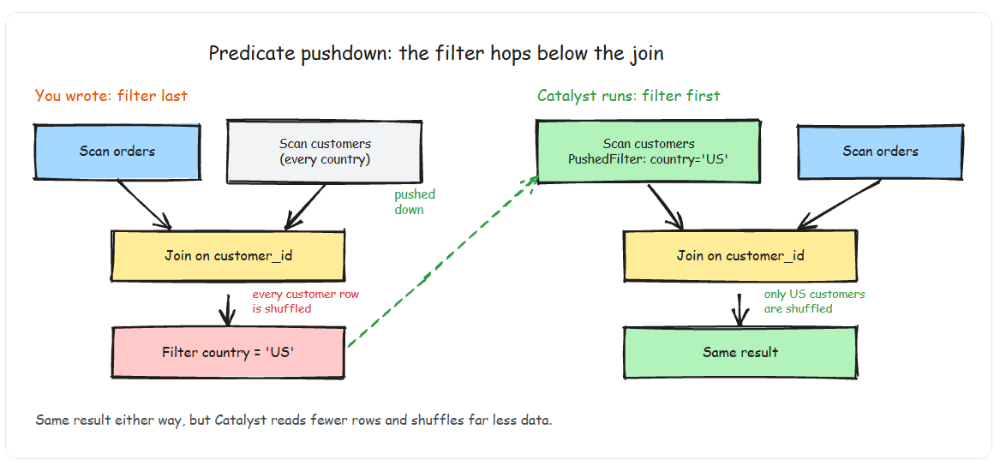

# Catalyst and Tungsten

## Introduction

- The PySpark code you write is almost never the code Spark actually executes. Between your DataFrame operations and the JVM bytecode that runs on the cluster, Spark rewrites your query — sometimes dramatically — through a multi-phase optimization pipeline called Catalyst, and then executes it using a memory-optimized runtime called Tungsten.



- You do not optimize PySpark by writing "faster" DataFrame code. You optimize by writing code that gives Catalyst the most information to work with — strong types, explicit schemas, and operations that the optimizer can reason about.

## The Catalyst Pipeline- 4 Phases
- Every DataFrame operation you write passes through four distinct phases before execution. Understanding these phases tells you what Spark can optimize automatically and what it cannot.

1. Phase 1: Parsing — The Unresolved Logical Plan
    - When you write `df.filter(F.col("status") == "active").select("name", "email")`, Spark does not execute anything immediately. It builds an abstract syntax tree — a logical plan — that says "filter this column, then project these columns." At this point, Spark has not even verified that the columns exist.

2. Phase 2: Analysis — The Resolved Logical Plan
    - Spark checks the plan against the catalog. Do columns status, name, and email exist? What are their types? If you reference a column that does not exist, this is where you get the AnalysisException. After resolution, every node in the tree has concrete type information.
3. Phase 3: Optimization — The Optimized Logical Plan
    - This is where Catalyst earns its keep. The optimizer applies a set of rule-based and cost-based transformations to rewrite your plan into something more efficient. The three most impactful optimizations are:

    1. Predicate Pushdown
        - Spark moves filters as close to the data source as possible.
        ```py
        # You write this:
        result = (
            orders
            .join(customers, "customer_id")
            .filter(F.col("country") == "US")
        )

        # Catalyst rewrites it to (conceptually):
        # Filter customers to US first, THEN join
        # This means far less data is shuffled

        ```
        
    2. Column Pruning
        - If you only use 3 columns out of 50, Spark tells the data source to read only those 3. For Parquet and ORC files, this means skipping entire column chunks at the I/O level. On wide tables, this alone can cut scan time by 80-90%.
    3. Join Reordering
        -  When you have multi-way joins, Catalyst can reorder them to minimize intermediate result sizes. If table A has 1 billion rows, table B has 10 million, and table C has 1,000, Catalyst may join B and C first to produce a small intermediate before touching A.
    
    - Note: You can inspect the optimized plan with df.explain(mode="extended"). Look at the "Optimized Logical Plan" section. If you see PushedFilters in the scan node, predicate pushdown is working. If columns are pruned, you will see a smaller ReadSchema than the full table schema.
4. Phase 4: Physical Planning — Choosing Execution Strategy
    - The optimized logical plan says what to compute. The physical plan says how. For example, a logical join can become:
        - BroadcastHashJoin if one side is small enough
        - SortMergeJoin if both sides are large
        - ShuffledHashJoin if one side is moderately smaller
    - Catalyst generates multiple candidate physical plans and uses a cost model (based on table statistics, data sizes, and configuration) to pick the cheapest one. This is why running ANALYZE TABLE or having accurate Delta Lake statistics matters — better statistics lead to better physical plan choices.

- UDF Warning
    - When you register a Python UDF, Catalyst treats it as a black box. It cannot push predicates through it, prune columns inside it, or reason about its output. This is the primary reason Python UDFs are 2-10x slower than built-in functions — not just the serialization overhead, but the loss of optimization opportunity.

