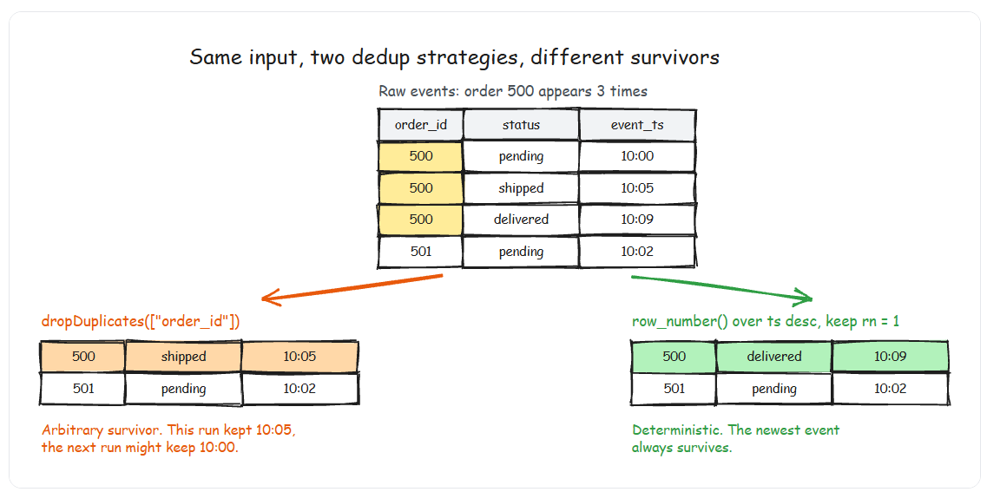

# Handling Dirty Data in Spark

- Production data is dirty. Not sometimes — always. Source systems send nulls where you expect values. Upstream teams change string formats without notice. CDC streams deliver duplicates on every rebalance. A column that was integers for two years suddenly contains the string "N/A" because someone edited a Google Sheet.

## Null Handling
- Nulls are the most common data quality issue and the most dangerous because they propagate silently. Any arithmetic on a null produces null. Any comparison with null returns null (not false). A join on a null key matches nothing. Your aggregation quietly drops null rows without warning.
- `.isNull()` is a column level operation, it simply returns a boolean value. If the field is Non-Null then it returns False and True when field is Null.
## Detecting Nulls
```py
from pyspark.sql.functions import col, isnan, when, count

# Check for nulls in specific columns
df.filter(col("customer_id").isNull()).count()

# Count nulls per column across the entire DataFrame
df.select([
    count(when(col(c).isNull(), c)).alias(c)
    for c in df.columns
]).show()

# Note: Here .count() and count() are two different things one is action while other is pyspark sql condition. Dont confuse with it.

# Check for both null AND NaN (common in float columns from pandas conversions)
df.filter(col("amount").isNull() | isnan(col("amount"))).count()

```
## Difference between Null and NaN
- PySpark distinguishes between null (missing value) and NaN (not a number, a special float value). isNull() catches nulls but not NaN. isnan() catches NaN but not nulls. When cleaning float columns — especially data that originated from pandas or CSV files — check for both. A column can contain a mix of nulls and NaN values that behave differently in aggregations.

## Use of fillna

- fillna() means: Find NULL values and replace them with the value I provide.

```py
df_clean = df.fillna({
    "customer_name": "Unknown",
    "amount": 0,
    "country_code": "XX",
    })

 # with coslesce we can write it as

 df.withColumn(
    "customer_name",
    coalesce(col("customer_name"), lit("Unknown"))
)
```

## Use of coalesce

- coalesce() = "Give me the first non-NULL value."
- coalesce() returns the first non-NULL value from left to right.
```py

df_clean = df.withColumn(
    "effective_email",
    coalesce(
        col("primary_email"),
        col("secondary_email"),
        lit("no-email@placeholder.com")
    )
)

# We have its SQL equivalent code as

COALESCE(
    primary_email,
    secondary_email,
    'no-email@placeholder.com'
)
```
- Think: Try primary → if NULL, try secondary → if NULL, use default.
- Example
```text
        primary_email       secondary_email
        ------------------------------------------
        a@gmail.com         b@gmail.com
        NULL                b@gmail.com
        NULL                NULL
        c@gmail.com         d@gmail.com
```
- after using above code, you get
```text
        effective_email
        ---------------------------
        a@gmail.com
        b@gmail.com
        no-email@placeholder.com
        c@gmail.com
```
```py
# Suppose you have  
coalesce(
    col("customer_name"),
    lit("Unknown")
    )

# Think of it as

        Option 1             Option 2
        ↓                     ↓
        customer_name       "Unknown"


 For each row

  Case 1:

            customer_name = "John"

            coalesce("John", "Unknown")
                    ↓
                "John"
 Case 2:

            customer_name = NULL

            coalesce(NULL, "Unknown")
                    ↓
                "Unknown"

#   Think coalesce() chooses the first non-NULL value from the arguments
```

- Another example for coalesce
```py
df_clean = df.withColumn(
    "display_name",
    coalesce(col("preferred_name"), col("full_name"), col("username"))
)
```

- When to use fillna vs coalesce: Use fillna when you want to replace nulls with a fixed default. Use coalesce when you have multiple candidate columns and want to pick the first non-null one. In practice, coalesce is more common in production because it handles the "fallback chain" pattern that appears everywhere in real data.

## Conditional Null Handling with when

```py
from pyspark.sql.functions import when

# Replace nulls conditionally based on other column values

df_clean = df.withColumn(
    "amount",
    when(col("amount").isNull() & (col("status") == "cancelled"), lit(0))
    .when(col("amount").isNull() & (col("status") == "pending"), lit(-1))
    .otherwise(col("amount"))
)

```

# Deduplication

- Duplicates are the second most common data quality issue. PySpark gives you two approaches: dropDuplicates and the window function dedup pattern. They are not interchangeable.

## dropDuplicates: Simple, No Control
```py
# Remove exact duplicate rows (all columns match)

df_deduped = df.dropDuplicates()

# Remove duplicates based on specific columns

df_deduped = df.dropDuplicates(["order_id"])

```
- dropDuplicates keeps an arbitrary row from each group of duplicates. You have no control over which row is kept. If your duplicates have different timestamps or different values in non-key columns, you cannot specify "keep the most recent one."

## Window Function Dedup: Full Control

```py
from pyspark.sql.functions import row_number, col
from pyspark.sql.window import Window

dedup_window = Window.partitionBy("order_id").orderBy(
    col("event_timestamp").desc(),
    col("ingestion_timestamp").desc()
)

df_deduped = (
    df
    .withColumn("rn", row_number().over(dedup_window))
    .filter(col("rn") == 1)
    .drop("rn")
)

```
- dropDuplicates vs Window Dedup: When to Use Which
    - Use dropDuplicates only when your duplicates are exact copies — every column is identical. This is rare in production. Use the window function pattern when duplicates have different values in any column (different timestamps, different status values, different ingestion metadata). The window pattern costs more (it triggers a shuffle and sort), but it gives you deterministic control over which row survives. In production, deterministic behavior is worth the cost.


## dropDuplicates Performance Note
- dropDuplicates uses a hash-based approach under the hood and does not require a full sort, making it faster than the window pattern. On a 1B row dataset, dropDuplicates might take 5 minutes while the window pattern takes 15 minutes. But if you need deterministic results — and in production you almost always do — the window pattern is the correct choice.

# String Cleaning

- Dirty strings are everywhere: leading/trailing whitespace, inconsistent casing, special characters, encoding issues. These cause silent join failures (because " Alice" does not equal "Alice") and broken aggregations (because "USA", "usa", and "U.S.A." are three different groups).

```py
from pyspark.sql.functions import trim, lower, upper, regexp_replace, initcap

# The standard string cleaning chain
df_clean = (
    df
    .withColumn("customer_name", trim(col("customer_name")))           # Remove whitespace
    .withColumn("email", lower(trim(col("email"))))                     # Lowercase + trim
    .withColumn("phone", regexp_replace(col("phone"), r"[^0-9]", ""))  # Keep only digits
    .withColumn("country", upper(trim(col("country"))))                 # Uppercase + trim
    .withColumn("city", initcap(trim(col("city"))))                     # Title Case
)

```
## Common regex patterns for data cleaning

- regexp_replace(column, pattern, replacement)

```py
# Remove all non-alphanumeric characters
regexp_replace(col("text"), r"[^a-zA-Z0-9\s]", "")

# Collapse multiple spaces into one
regexp_replace(col("text"), r"\s+", " ")

# Extract digits from a mixed string (e.g., "Order #12345" -> "12345")
from pyspark.sql.functions import regexp_extract
df.withColumn("order_num", regexp_extract(col("order_ref"), r"(\d+)", 1))

# regexp_extract(column, regex, group_number)

# Replace known dirty values with null
from pyspark.sql.functions import when
df.withColumn(
    "email",
    when(col("email").isin("N/A", "n/a", "null", "none", ""), None)
    .otherwise(col("email"))
)

```
- Clean Before You Join
    - Always apply string cleaning before joins. A join on customer_name will fail to match " Alice Smith " with "alice smith" because of whitespace and casing differences. The five-second fix: trim(lower(col("customer_name"))) on both sides before the join. This single practice eliminates an enormous category of "missing data" bugs that are actually just dirty string bugs.


