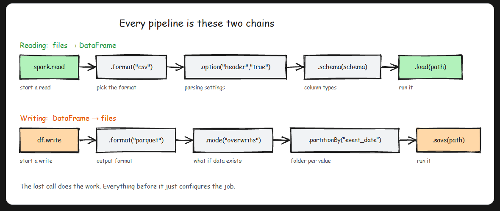
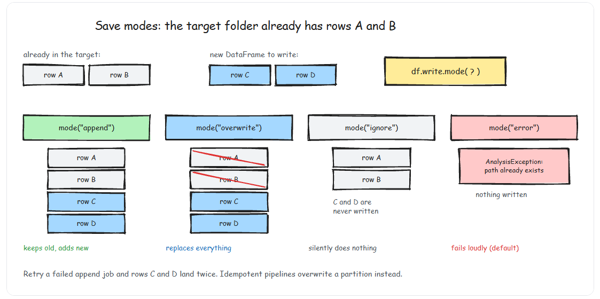

# Reading and Writing of Data



## Read API

- `DataFrameReader.format(...).option("key", "value").schema(...).load()`

```py
spark.read.format("csv")\
    .option("mode", "FAILFAST")\  # We have three modes- permissive, dropMalformed, failFast
    .option("inferSchema", "true")\
    .option("path", "path/to/file(s)")\
    .schema(someSchema)\
    .load()
```

### Three Read Modes:

1. permissive (default):
    - Sets corrupt fields to null, puts corrupt records in _corrupt_record column
2. dropMalformed:
    - Drops rows with malformed records entirely
3. failFast:
    - Fails immediately on the first malformed record

## Write API

- `DataFrameWriter.format(...).option(...).partitionBy(...).bucketBy(...).sortBy(...).save()`

```py
dataframe.write.format("csv")\
    .option("mode", "OVERWRITE")\
    .option("path", "path/to/file(s)")\
    .save()
```

### Four save modes

1. errorIfExists (default):
    - Fails if data already exists at the location
2. append:
    - Appends to existing data
3. overwrite:
    - Completely overwrites existing data
4. ignore:
    - Does nothing if data already exists



### Overwrite vs Append: The Idempotency Decision

- append is dangerous for pipeline retries — if a job fails halfway and reruns, you get duplicate data. overwrite on a partition is idempotent — rerunning produces the same result. For most batch pipelines, the correct pattern is: partition your data by date, and overwrite the specific partition being processed. This makes retries safe and eliminates the most common source of duplicates.

### Partitioned Writes
- Partitioning writes data into subdirectories organized by column values. Downstream queries that filter on the partition column skip irrelevant directories entirely (partition pruning).

```py
# Partition by date — the most common strategy
(df.write
 .format("parquet")
 .mode("overwrite")
 .partitionBy("event_date")
 .save("s3://bucket/silver/events/"))
# Creates: .../events/event_date=2026-03-15/part-00000.parquet
#          .../events/event_date=2026-03-16/part-00000.parquet

```

### Bucketing

- Bucketing groups data with the same bucket ID into the same physical file. This avoids shuffles later when joining or aggregating on the bucketed column

```py
numberBuckets = 10
columnToBucketBy = "count"

csvFile.write.format("parquet").mode("overwrite")\
    .bucketBy(numberBuckets, columnToBucketBy)\
    .saveAsTable("bucketedFiles")

```
### Partitioning vs Bucketing
- Partition by columns with low cardinality that you frequently filter on (date, country, region). Bucket by columns with high cardinality that you frequently join on (user_id, order_id). Partitioning creates directory structure; bucketing organizes data within files.

## Never Use "inferSchema = true" in Production
- inferSchema reads the entire file twice — once to infer types, once to load data. It doubles your read time. Worse, it guesses types based on the data it sees: a column of "123" values gets inferred as integer, but when next month's file contains "123A", the job fails. Always define your schema explicitly with StructType or read everything as strings and cast intentionally.
