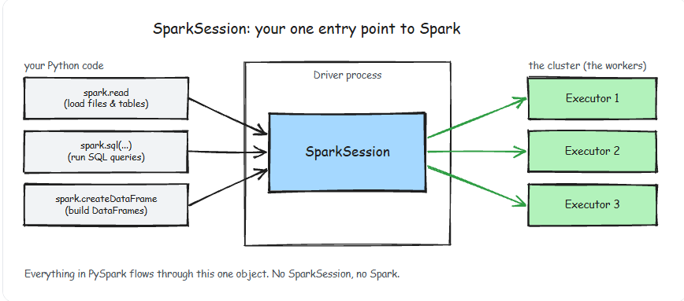
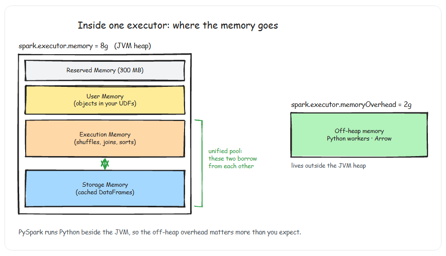

# Introduction
- Every PySpark application starts with exactly one object: the `SparkSession`. It is your entry point to everything — reading data, creating DataFrames, running SQL, accessing the Spark catalog. If you do not have a SparkSession, you do not have Spark.



# creating a sparksession
```py
from pyspark.sql import SparkSession

spark = SparkSession.builder.appName('my_spark').getOrCreate()
```
- There is only one SparkSession per JVM. If you call `.getOrCreate()` in two different places in your code, you get the same session.
```py
spark = SparkSession.builder
        .appName('my_session')
        .config('spark.sql.shuffle.partitions','200')
        .config('spark.sql.adaptive.enabled','true')
        .config('spark.serializer','org.apache.spark.serializer.KryoSerializer')
        .getOrCreate()
```

## Understanding Partitions
```py
.config('spark.sql.shuffle.partitions','200') # It is default setting
```

- Every time Spark performs a `groupBy`, `join`, or `distinct`, it shuffles data — redistributing it across partitions. The default number of output partitions for a shuffle is 200. This is almost always wrong for your workload.
    - Processing 100 MB of data? 200 partitions means each partition is 500 KB — absurdly small, drowning in scheduling overhead.
    - Processing 500 GB of data? 200 partitions means each partition is 2.5 GB — too large, likely causing OOM errors.
- **The Rule of Thumb**: set shuffle partitions so each partition is `128-256 MB` after the shuffle. For a 50 GB dataset, that means roughly 200-400 partitions. For a 2 GB dataset, 8-16.

## Adaptive Query Execution

- If you enable Adaptive Query Execution (AQE), Spark will automatically coalesce shuffle partitions that are too small. Set shuffle partitions high (e.g., 2000) and let AQE reduce them. This is the modern best practice — it handles both small and large datasets gracefully.

```py
.config('spark.sql.adaptive.enabled','true')  # This is enabled since spark 3.2

.config('spark.sql.adaptive.coalescePartitions.enabled','true')

.config('spark.sql.adaptive.skewJoin.enabled','true')
```

- AQE is the single most impactful feature added to Spark in the last five years. It re-optimizes your query plan at runtime based on actual data statistics, rather than relying on potentially stale catalog stats. It does three things:
    - Coalesces small shuffle partitions — combines tiny partitions into larger ones
    - Handles skewed joins — splits oversized partitions so no single task bottlenecks the job
    - Switches join strategies — converts sort-merge joins to broadcast joins when it detects a small table at runtime

## Memory Configuration

```py
.config('spark.executor.memory','8g')   # heap memory per executor

.config('spark.executor.memoryOverhead','2g')   # off-heap memory (python arrow, overhead)

.config('spark.driver.memory','4g')  # driver heap
```

- PySpark is especially memory-hungry because it runs Python processes alongside the JVM. The memoryOverhead setting controls the off-heap memory allocated for Python workers, Arrow serialization, and other non-JVM needs. The default is often too low — if you see errors containing "Container killed by YARN for exceeding memory limits," bump memoryOverhead first.



- Setting `spark.executor.memory` to the full amount of RAM on your node will cause OOM kills. You must leave room for the OS, YARN overhead, and off-heap memory. A safe rule: `executor memory + memoryOverhead` should not exceed **75%**     of the node's total RAM.

## Other configurations worth knowing

```py
# Use Kryo serializer — faster than Java default
.config("spark.serializer", "org.apache.spark.serializer.KryoSerializer")

# Broadcast threshold — tables smaller than this are broadcast in joins
.config("spark.sql.autoBroadcastJoinThreshold", "50m")  # default 10m

# Dynamic allocation — let Spark scale executors up/down
.config("spark.dynamicAllocation.enabled", "true")
.config("spark.dynamicAllocation.minExecutors", "2")
.config("spark.dynamicAllocation.maxExecutors", "50")

```

## A production ready session factory

```py
# spark_utils.py
from pyspark.sql import SparkSession
import os

def get_spark_session(app_name: str = "default-app") -> SparkSession:
    is_local = os.environ.get("SPARK_ENV", "local") == "local"

    builder = (
        SparkSession.builder
        .appName(app_name)
        .config("spark.sql.adaptive.enabled", "true")
        .config("spark.sql.adaptive.coalescePartitions.enabled", "true")
        .config("spark.serializer", "org.apache.spark.serializer.KryoSerializer")
    )

    if is_local:
        builder = (
            builder
            .master("local[*]")
            .config("spark.driver.memory", "4g")
            .config("spark.sql.shuffle.partitions", "8")
        )
    else:
        builder = (
            builder
            .config("spark.sql.shuffle.partitions", "2000")
            .config("spark.dynamicAllocation.enabled", "true")
        )

    return builder.getOrCreate()
```
## Key Takeaways

- `SparkSession` is the single entry point for all PySpark operations — create it once with `getOrCreate()` and pass it through your application
- Shuffle partitions (default 200) is the most common source of performance problems — set it based on your data size or set it high and let AQE coalesce
- AQE (Adaptive Query Execution) re-optimizes at runtime — enable it always unless you have a specific reason not to
- `spark.executor.memoryOverhead` is critical for PySpark — Python workers need off-heap memory beyond the JVM heap
- se `local[*]` for development with small shuffle partitions (8-16) and centralize your session config in a utility module