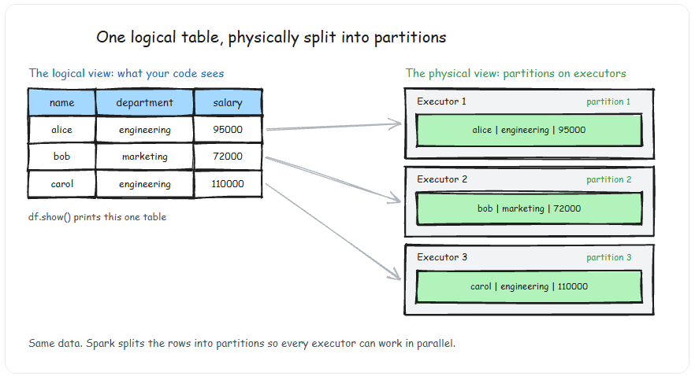
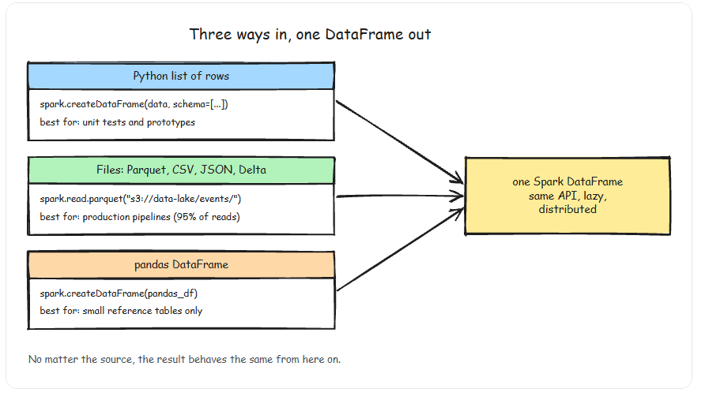
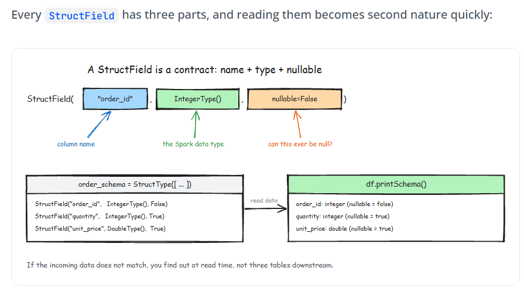

# DataFrames Basics

- A DataFrame is the most common Structured API in Spark — it simply represents a table of data with rows and columns, similar to a table in a relational database or a DataFrame in pandas/R.
- A pandas DataFrame lives in memory on one machine. A PySpark DataFrame is a description of a computation distributed across a cluster. When you call `df.filter(...)`, nothing happens — Spark just records the operation in a DAG. This distinction matters because it changes how you think about debugging, performance, and data validation.

- To allow every executor to perform work in parallel, Spark breaks up the data into chunks called partitions. A DataFrame's partitions represent how the data is physically distributed across the cluster during execution.
## spark types
- Spark maintains its own type system through the Catalyst engine. You can import Spark types in your code:
```py
from pyspark.sql.types import *

# Common Types: StringType, IntegerType, LongType, DoubleType, BooleanType, DateType, TimestampType, ArrayType, MapType, StructType.
```

## Creating DataFrames:
- There are three common ways to create DataFrame. Each serves different purpose.


1. Creating DataFrame from list of rows (Used for Testing and Prototyping)

```py
from pyspark.sql import SparkSession

spark = SparkSession.builder.appName('my_spark_session').getOrCreate()  # Here we are taking into consideration about .config()

data = [
    ('alice','engineering',95000),
    ('bob','marketing',72000),
    ('carol','engineering',110000)
    ]
schema = ['name','department','salary']

df = spark.createDataFrame(data,schema)

df.show()


Output->

+-----+-----------+------+
| name| department|salary|
+-----+-----------+------+
|alice|engineering| 95000|
|  bob|  marketing| 72000|
|carol|engineering|110000|
+-----+-----------+------+
```
- This approach is indispensable for writing unit tests. You create small DataFrames with known data, run your transformation logic, and assert on the output.


2. From Files (Production Pipelines)
- This is how we will create DataFrames 95% of the time in real work.
```py
# Parquet — the default for data engineering
df = spark.read.parquet("s3://data-lake/events/2026/03/")

# CSV with header and inferred schema
df = spark.read.option("header", "true").option("inferSchema", "true").csv("s3://landing/orders.csv")

# JSON (one JSON object per line)
df = spark.read.json("s3://landing/api_responses/")

# Delta Lake (if your platform supports it)
df = spark.read.format("delta").load("s3://data-lake/silver/customers/")
```
- Never use inferSchema in production pipelines. Schema inference reads a sample of your data to guess types — it is slow, non-deterministic, and will silently produce wrong types when your data has mixed values (e.g., a column that is "123" in most rows but "N/A" in one). Always define your schema explicitly.

3. From a pandas DataFrame (Migration and interop)

```py
import pandas as pd

pandas_df = pd.DataFrame({
    "order_id": [1, 2, 3],
    "total": [29.99, 49.50, 15.00],
})

spark_df = spark.createDataFrame(pandas_df)
```
- This works, but it is a trap at scale. Converting a pandas DataFrame to PySpark requires serializing all the data through the driver. If your pandas DataFrame is 5 GB, the driver needs 5 GB of memory just for the conversion. Use this for small reference tables (under 100 MB), never for large datasets.
- If you must convert between pandas and PySpark, enable Apache Arrow for 10-100x faster serialization.
```py
spark.conf.set("spark.sql.execution.arrow.pyspark.enabled", "true")
```
- Arrow uses columnar memory format and avoids the row-by-row serialization bottleneck. It is one of those configs you should always have on.

## Defining Schemas explicitly with StructType()

- Explicit schemas are non-negotiable in production. They serve as a contract: "this is the shape and type of data I expect." If the actual data does not match, you find out immediately rather than discovering corrupt values three tables downstream.

```py
from pyspark.sql.types import (
    StructType, StructField, StringType, IntegerType,
    DoubleType, TimestampType, BooleanType
)

order_schema = StructType([
    StructField("order_id", IntegerType(), nullable=False),
    StructField("customer_id", StringType(), nullable=False),
    StructField("product_name", StringType(), nullable=True),
    StructField("quantity", IntegerType(), nullable=True),
    StructField("unit_price", DoubleType(), nullable=True),
    StructField("order_timestamp", TimestampType(), nullable=False),
    StructField("is_returned", BooleanType(), nullable=True),
])

df = spark.read.schema(order_schema).parquet("s3://data-lake/raw/orders/")

```


## Essential DataFrame operations

```py
df.show()           # first 20 rows, truncated to 20 chars

df.show(5)          # first 5 rows

df.show(5, False)   # first 5 rows, no truncation

df.show(vertical=True)  # vertical format for wide tables

# df.show() is an action — it triggers execution of the entire DAG up to that point.
---------------------------------------------------------

df.printSchema()  #  Inspect the Schema


-------------------------------------------------------------

df.count()    # Row Count

--------------------------------------------------------

df.columns   # ['order_id', 'customer_id', 'product_name', ...]

df.dtypes    # [('order_id', 'int'), ('customer_id', 'string'), ...]


```
- .count() forces a full scan of the data. On a 100 GB dataset, this can take minutes. In production pipelines, avoid using .count() for validation unless you genuinely need the exact count. If you just need to verify the DataFrame is not empty, use df.head(1) instead — it reads only one partition.


## Key Takeaways

- Create DataFrames from lists (testing), files (production), or pandas (small reference tables only).
- Always define schemas explicitly with `StructType` — never use `inferSchema` in production
- Use `DecimalType` instead of `DoubleType` for financial data to avoid floating-point precision errors
- PySpark DataFrames are **immutable** and lazily evaluated — every transformation returns a new DataFrame, and nothing executes until you call an action.
- `.show()` and `.count()` are actions that trigger execution — use them deliberately, not casually
- Enable Arrow (`spark.sql.execution.arrow.pyspark.enabled`) when converting between pandas and PySpark.
