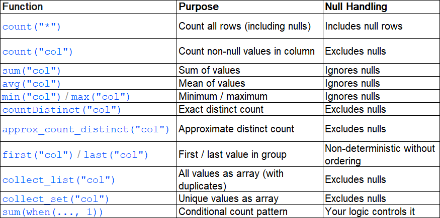

# Aggregations
- A critical thing to internalize: every `groupBy` triggers a shuffle. Spark must redistribute data across the cluster so that all rows belonging to the same group land on the same partition. This is expensive. Understanding aggregations means understanding both the API and the performance cost underneath.

```py
from pyspark.sql import SparkSession
from pyspark.sql.functions import (
    col, count, sum, avg, min, max,
    countDistinct, approx_count_distinct,
    round, first, collect_list, collect_set,
    expr
)

import os
import sys

os.environ["PYSPARK_PYTHON"] = sys.executable
os.environ["PYSPARK_DRIVER_PYTHON"] = sys.executable

print("Python:", sys.executable)

from pyspark.sql import SparkSession

spark = (
    SparkSession.builder
    .appName("PySpark_Test_1")
    .master("local[*]")
    .config("spark.pyspark.python", sys.executable)
    .config("spark.pyspark.driver.python", sys.executable)
    .getOrCreate()
)

data = [
    ("2026-03-01", "electronics", "laptop", 1200.00, 3),
    ("2026-03-01", "electronics", "phone", 800.00, 7),
    ("2026-03-01", "clothing", "jacket", 150.00, 12),
    ("2026-03-01", "clothing", "shoes", 90.00, 20),
    ("2026-03-02", "electronics", "laptop", 1200.00, 5),
    ("2026-03-02", "electronics", "tablet", 600.00, 4),
    ("2026-03-02", "clothing", "jacket", 150.00, 8),
    ("2026-03-02", "clothing", "shoes", 90.00, 15),
    ("2026-03-03", "electronics", "phone", 800.00, 6),
    ("2026-03-03", "clothing", "jacket", 150.00, 10),
    ("2026-03-03", "clothing", "shoes", 90.00, 18),
    ("2026-03-03", "electronics", "laptop", 1200.00, 2),
]

df = spark.createDataFrame(
    data,
    schema=["order_date", "category", "product", "unit_price", "quantity"]
)

```

## groupBy + agg --> The core pattern

```py
df.groupBy("category").agg(
    count("*").alias("total_orders"),
    sum("quantity").alias("total_units"),
    round(avg("unit_price"), 2).alias("avg_price"),
).show()

```
- You can write `df.groupBy("category").count()` or `df.groupBy("category").sum("quantity")` — but these only compute a single aggregate at a time. In production, you almost always need multiple metrics per group. The .agg() method lets you compute them all in one pass.
- Always use `.agg()` with explicit `.alias()` for every aggregate column. Without aliases, Spark generates names like sum(quantity) and avg(unit_price) — these break downstream code that references columns by name and make your schema unreadable.

## Built-in Aggregate Functions



## approx_count_distinct — The Production Choice

- When you need distinct counts on high-cardinality columns (user IDs, session IDs) at scale, countDistinct is expensive — it requires a full shuffle to compare every value. approx_count_distinct uses HyperLogLog to estimate the count with about 2% error

```py
df.groupBy("category").agg(
    countDistinct("product").alias("exact_products"),
    approx_count_distinct("product").alias("approx_products"),
    approx_count_distinct("product", 0.01).alias("approx_products_1pct"),  # tighter error bound
).show()

```
- For daily metrics dashboards, `approx_count_distinct` is almost always the right choice. The 2% default error is negligible for business reporting, and the performance difference is dramatic — I have seen jobs go from 45 minutes to 8 minutes just by switching from exact to approximate distinct counts on a 500M row dataset.

## Conditional Aggregation — The sum(when(...)) Pattern
- One of the most useful patterns in data engineering is conditional counting or summing

```py
df.groupBy(col('order_date')).agg(
    sum(col('quantity')).alias('total_quantity'),
    sum(when (col('category') == 'electronics', col('quantity')).otherwise(0)).alias('electronics_quantity'),
    sum(when (col('category') == 'clothing', col('quantity')).otherwise(0)).alias('clothing_quantity')
).show()

Output->
+----------+--------------+--------------------+-----------------+
|order_date|total_quantity|electronics_quantity|clothing_quantity|
+----------+--------------+--------------------+-----------------+
|2026-03-01|            42|                  10|               32|
|2026-03-02|            32|                   9|               23|
|2026-03-03|            36|                   8|               28|
+----------+--------------+--------------------+-----------------+
```
## collect_list and collect_set — Arrays from Groups

- Sometimes you need to collect individual values rather than summarize them

```py
df.groupBy(col('category')).agg(
    collect_set(col('product')).alias('products'),
    collect_list(col('category')).alias('all_products')
).show(truncate= False)

output-->
+-----------+-----------------------+------------------------------------------------------------------------------+
|category   |products               |all_products                                                                  |
+-----------+-----------------------+------------------------------------------------------------------------------+
|electronics|[tablet, laptop, phone]|[electronics, electronics, electronics, electronics, electronics, electronics]|
|clothing   |[shoes, jacket]        |[clothing, clothing, clothing, clothing, clothing, clothing]                  |
+-----------+-----------------------+------------------------------------------------------------------------------+
```
- `collect_list` and `collect_set` pull all values for a group into a single array on one executor. If a group has millions of values, this will cause OOM errors. Use these only when you know the cardinality per group is bounded — for example, collecting product names per category (dozens) rather than user IDs per country (millions).

## pivot — Rows to Columns

- `pivot` transforms distinct values from a column into separate columns — turning a long/narrow table into a wide one. This is essential for building feature tables, cross-tab reports, and dimension-based metrics.

```py
df.groupBy("order_date").pivot("category").agg(
    sum("quantity").alias("units")
).orderBy("order_date").show()
```
- By default, Spark scans the entire column to find distinct values — which requires an extra pass over the data. In production, always specify the expected values

```py
df.groupBy("order_date").pivot(
    "category",
    ["electronics", "clothing"]  # explicit values — avoids extra scan
).agg(
    sum("quantity").alias("units")
).orderBy("order_date").show()


+----------+--------+-----------+
|order_date|clothing|electronics|
+----------+--------+-----------+
|2026-03-01|      32|         10|
|2026-03-02|      23|          9|
|2026-03-03|      28|          8|
+----------+--------+-----------+
```
- Always pass the list of pivot values explicitly. Without it, Spark runs an extra job to discover distinct values — on a large dataset, this can take as long as the actual aggregation. In production pipelines, you should know the valid dimension values upfront or query them from a reference table.

- When you pivot with multiple aggregations, Spark creates columns for each combination of pivot value and aggregate:

```py
df.groupBy("order_date").pivot(
    "category",
    ["electronics", "clothing"]
).agg(
    sum("quantity").alias("units"),
    round(avg("unit_price"), 2).alias("avg_price"),
).orderBy("order_date").show()


+----------+-----------------+---------------------+--------------+------------------+
|order_date|electronics_units|electronics_avg_price|clothing_units|clothing_avg_price|
+----------+-----------------+---------------------+--------------+------------------+
|2026-03-01|               10|               1000.0|            32|             120.0|
|2026-03-02|                9|                900.0|            23|             120.0|
|2026-03-03|                8|               1000.0|            28|             120.0|
+----------+-----------------+---------------------+--------------+------------------+
```

## Key Takeaways

- Always use `groupBy(...).agg(...)` with explicit `.alias()` on every aggregate — this is the production pattern
- Use `approx_count_distinct` instead of `countDistinct` for high-cardinality columns — 2% error for 5-10x performance improvement
- The `sum(when(...))` pattern replaces SQL's `SUM(CASE WHEN ...)` for conditional aggregation — use it to build wide metrics tables
- Always specify pivot values explicitly to avoid an extra data scan
- `collect_list` and `collect_set` can OOM on large groups — use them only when group cardinality is bounded
- Every `groupBy` triggers a shuffle — combine aggregates into a single agg call when possible