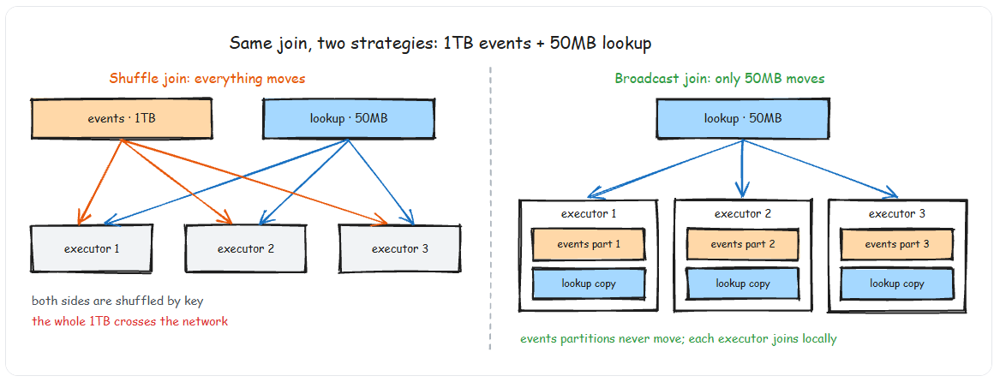

# Joins
- A join expression compares the value of one or more keys from the left and right datasets. A join type determines what to keep in the result.
```py
person = spark.createDataFrame([
    (0, "Bill Chambers", 0, [100]),
    (1, "Matei Zaharia", 1, [500, 250, 100]),
    (2, "Michael Armbrust", 1, [250, 100])
]).toDF("id", "name", "graduate_program", "spark_status")

graduateProgram = spark.createDataFrame([
    (0, "Masters", "School of Information", "UC Berkeley"),
    (2, "Masters", "EECS", "UC Berkeley"),
    (1, "Ph.D.", "EECS", "UC Berkeley")
]).toDF("id", "degree", "department", "school")

joinExpression = person["graduate_program"] == graduateProgram["id"]

person.show()

+---+----------------+----------------+---------------+
| id|            name|graduate_program|   spark_status|
+---+----------------+----------------+---------------+
|  0|   Bill Chambers|               0|          [100]|
|  1|   Matei Zaharia|               1|[500, 250, 100]|
|  2|Michael Armbrust|               1|     [250, 100]|
+---+----------------+----------------+---------------+

graduate_program.show()

+---+-------+--------------------+-----------+
| id| degree|          department|     school|
+---+-------+--------------------+-----------+
|  0|Masters|School of Informa...|UC Berkeley|
|  2|Masters|                EECS|UC Berkeley|
|  1|  Ph.D.|                EECS|UC Berkeley|
+---+-------+--------------------+-----------+

# Inner Join
# Keeps only rows with keys that exist in both datasets. This is the default join type.

person.join(graduateProgram, joinExpression).show()

+---+----------------+----------------+---------------+---+-------+--------------------+-----------+
| id|            name|graduate_program|   spark_status| id| degree|          department|     school|
+---+----------------+----------------+---------------+---+-------+--------------------+-----------+
|  0|   Bill Chambers|               0|          [100]|  0|Masters|School of Informa...|UC Berkeley|
|  1|   Matei Zaharia|               1|[500, 250, 100]|  1|  Ph.D.|                EECS|UC Berkeley|
|  2|Michael Armbrust|               1|     [250, 100]|  1|  Ph.D.|                EECS|UC Berkeley|
+---+----------------+----------------+---------------+---+-------+--------------------+-----------+

# Outer Join

# Keeps rows with keys in either dataset. Nulls where there is no match.

person.join(graduateProgram, joinExpression, "outer").show()

+----+----------------+----------------+---------------+---+-------+--------------------+-----------+
|  id|            name|graduate_program|   spark_status| id| degree|          department|     school|
+----+----------------+----------------+---------------+---+-------+--------------------+-----------+
|   0|   Bill Chambers|               0|          [100]|  0|Masters|School of Informa...|UC Berkeley|
|   1|   Matei Zaharia|               1|[500, 250, 100]|  1|  Ph.D.|                EECS|UC Berkeley|
|   2|Michael Armbrust|               1|     [250, 100]|  1|  Ph.D.|                EECS|UC Berkeley|
|NULL|            NULL|            NULL|           NULL|  2|Masters|                EECS|UC Berkeley|
+----+----------------+----------------+---------------+---+-------+--------------------+-----------+


# Left Outer Join

# Keeps all rows from the left, matched rows from the right. Nulls where the right has no match.

graduateProgram.join(person, joinExpression, "left_outer").show()

+---+-------+--------------------+-----------+----+----------------+----------------+---------------+
| id| degree|          department|     school|  id|            name|graduate_program|   spark_status|
+---+-------+--------------------+-----------+----+----------------+----------------+---------------+
|  0|Masters|School of Informa...|UC Berkeley|   0|   Bill Chambers|               0|          [100]|
|  2|Masters|                EECS|UC Berkeley|NULL|            NULL|            NULL|           NULL|
|  1|  Ph.D.|                EECS|UC Berkeley|   2|Michael Armbrust|               1|     [250, 100]|
|  1|  Ph.D.|                EECS|UC Berkeley|   1|   Matei Zaharia|               1|[500, 250, 100]|
+---+-------+--------------------+-----------+----+----------------+----------------+---------------+

# Right Outer Join

# Keeps all rows from the right, matched rows from the left. Nulls where the left has no match.

person.join(graduateProgram, joinExpression, "right_outer").show()

+----+----------------+----------------+---------------+---+-------+--------------------+-----------+
|  id|            name|graduate_program|   spark_status| id| degree|          department|     school|
+----+----------------+----------------+---------------+---+-------+--------------------+-----------+
|   0|   Bill Chambers|               0|          [100]|  0|Masters|School of Informa...|UC Berkeley|
|NULL|            NULL|            NULL|           NULL|  2|Masters|                EECS|UC Berkeley|
|   2|Michael Armbrust|               1|     [250, 100]|  1|  Ph.D.|                EECS|UC Berkeley|
|   1|   Matei Zaharia|               1|[500, 250, 100]|  1|  Ph.D.|                EECS|UC Berkeley|
+----+----------------+----------------+---------------+---+-------+--------------------+-----------+

# left-semi Join

# Keeps rows in the left dataset where the key exists in the right — but does NOT include any columns from the right. Think of it as a filter, not a traditional join.

graduateProgram.join(person, joinExpression, "left_semi").show()

+---+-------+--------------------+-----------+
| id| degree|          department|     school|
+---+-------+--------------------+-----------+
|  0|Masters|School of Informa...|UC Berkeley|
|  1|  Ph.D.|                EECS|UC Berkeley|
+---+-------+--------------------+-----------+

# left-anti Join

# The opposite of semi — keeps rows in the left dataset where the key does NOT exist in the right. This is your NOT IN filter.

graduateProgram.join(person, joinExpression, "left_anti").show()

+---+-------+----------+-----------+
| id| degree|department|     school|
+---+-------+----------+-----------+
|  2|Masters|      EECS|UC Berkeley|
+---+-------+----------+-----------+
```
## left_semi and left_anti joins

- The two that trip people up are anti and semi joins. Anti joins are your "find orphan records" tool — orders with no matching customer, events with no matching session. Semi joins are your "filter left table by existence in right table" tool — they work like an IN subquery but are far more efficient at scale
- Anti Joins Replace `LEFT JOIN + WHERE IS NULL`. In SQL, you might write LEFT JOIN ... WHERE right.id IS NULL to find unmatched rows. In PySpark, use left_anti instead. It is semantically clearer and Spark can optimize it more aggressively because it knows you do not need any columns from the right side.

## Join Condition Gotcha: Duplicate Columns

- When you join on a column name that exists in both DataFrames, PySpark can produce duplicate column names.

```py
# This creates TWO "customer_id" columns — one from each side

orders.join(customers, orders.customer_id == customers.customer_id, "inner")

# This keeps ONE "customer_id" column — pass the column name as a string

orders.join(customers, "customer_id", "inner")

# For different column names, drop the duplicate explicitly

orders.join(
    customers,
    orders.cust_id == customers.customer_id,
    "inner"
).drop(customers.customer_id)

```
## How spark performs joins

1. Big Table to Big Table — Shuffle Join
    - When both tables are large, Spark performs a shuffle join — every node talks to every other node, sharing data according to which node has a certain key. This is expensive because the network becomes congested, especially if data is not partitioned well.
2. Big Table to Small Table — Broadcast Join
    - When one table is small enough to fit in memory on a single worker, it is more efficient to use a broadcast join. Spark replicates the small DataFrame onto every worker node. This sounds expensive, but the one-time broadcast cost is far cheaper than the all-to-all shuffle. After the initial broadcast, each worker performs the join locally with no further network communication.
    ```py
    from pyspark.sql.functions import broadcast

    # Force broadcast of the small dimension table
    enriched = events.join(
        broadcast(country_lookup),
        "country_code",
        "left"
        )

    ```


3. Sort-Merge Joins: The Large Table Default
    - When both tables are too large to broadcast, Spark falls back to a sort-merge join. Both tables are shuffled by the join key so that matching keys land on the same partition, then each partition is sorted and merged.
```py
# Spark chooses sort-merge join automatically for large-to-large joins

large_events.join(large_sessions, "session_id", "inner")

# You can confirm the join strategy in the query plan

large_events.join(large_sessions, "session_id", "inner").explain()

# Look for "SortMergeJoin" or "BroadcastHashJoin" in the output


```

# Skewed Joins: When One Key Has Millions of Rows

- Data skew is the silent killer of Spark joins. If 80% of your events have country_code = "US", then after the shuffle, one partition gets 80% of the data while the other partitions finish in seconds. Your job takes as long as the slowest partition.

## The Salt Key Technique

- The standard fix for skewed joins is salting — you add a random suffix to the skewed key to distribute its rows across multiple partitions.

```py
from pyspark.sql.functions import col, lit, rand, floor, concat, explode, array

num_salts = 10  # Split the skewed key across 10 partitions

# Salt the large (skewed) side — append a random salt
salted_events = events.withColumn(
    "salted_key",
    concat(col("country_code"), lit("_"), floor(rand() * num_salts).cast("int"))
)

# Explode the small side — create 10 copies, one per salt value
salted_countries = countries.withColumn(
    "salt",
    explode(array([lit(i) for i in range(num_salts)]))
).withColumn(
    "salted_key",
    concat(col("country_code"), lit("_"), col("salt"))
)

# Join on the salted key — the skewed key is now distributed across 10 partitions
result = salted_events.join(
    salted_countries,
    "salted_key",
    "inner"
).drop("salted_key", "salt")

```
## AQE Skew Join Optimization
```py
spark.conf.set("spark.sql.adaptive.enabled", "true")  # Default true in Spark 3.2+
spark.conf.set("spark.sql.adaptive.skewJoin.enabled", "true")
spark.conf.set("spark.sql.adaptive.skewJoin.skewedPartitionFactor", "5")
spark.conf.set("spark.sql.adaptive.skewJoin.skewedPartitionThresholdInBytes", "256m")

```
- AQE splits skewed partitions at runtime without requiring manual salting. It is less work but gives you less control. For predictable, known skew patterns, manual salting is more reliable. For unpredictable skew, AQE is the pragmatic choice.

## Common Join Mistakes in Production
- Joining without deduplicating first. If the right side has duplicate keys, a join produces a Cartesian product for those keys. 10 left rows matching 10 right rows with the same key produces 100 output rows. Always dropDuplicates on the join key of the lookup side before joining.
- Forgetting that full outer joins disable broadcast. Spark cannot broadcast a full outer join — both sides must be shuffled. If you are doing a full outer join on a small table, consider whether a left join plus a separate anti join would be faster.
- Chaining multiple joins without checkpointing. Five joins chained together create an enormous lineage graph. If any partition fails, Spark recomputes everything from scratch. Add .checkpoint() or .persist() after every 2-3 joins in a long chain.