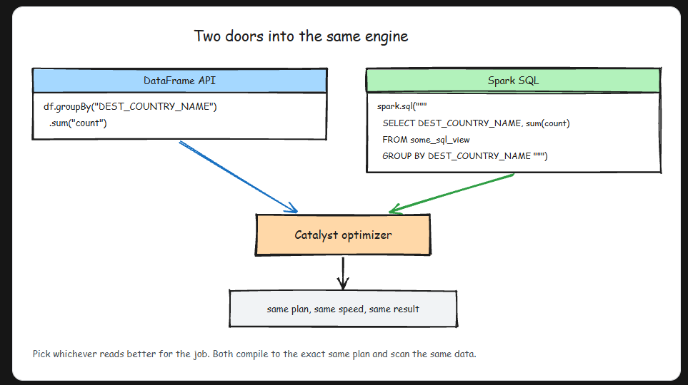
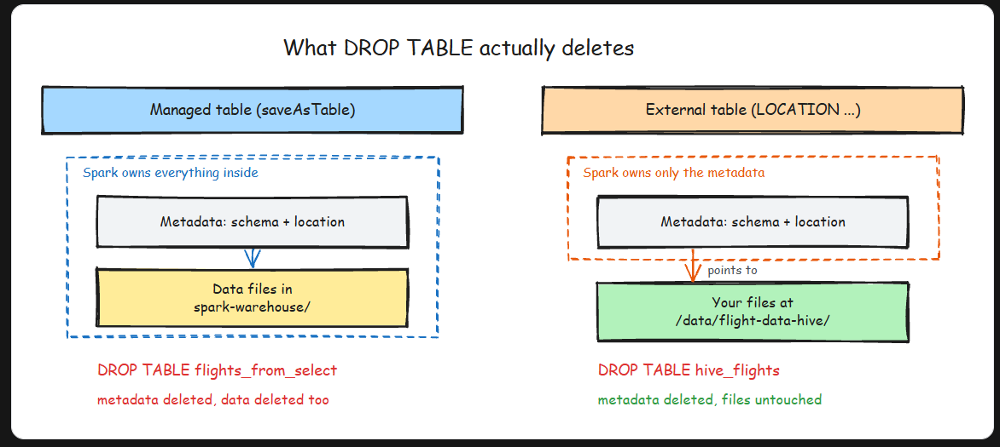

# Spark SQL
- SQL and the DataFrame API are two doors into the same engine.


## How to run SQL queries in Spark:
- To query a DataFrame we have to register it as a temporary view first.
```py
# First we create a dataframe

df = spark.read.format('json').load('path')

df.createOrReplaceTempView('df_sql')  # This will create a temp view for sql

spark.read.json("/data/flight-data/json/2015-summary.json")\
    .createOrReplaceTempView("some_sql_view")

spark.sql("""
    SELECT DEST_COUNTRY_NAME, sum(count)
    FROM some_sql_view
    GROUP BY DEST_COUNTRY_NAME
    """)\
    .where("DEST_COUNTRY_NAME like 'S%'")\
    .where("`sum(count)` > 10")\
    .count()

```

## Spark Tables: Managed Tables and Unmanaged(external) Tables

-   Tables store two pieces of information: the data and the metadata (schema, location, partitioning).
- Managed table — Created with saveAsTable. Spark manages both the data AND metadata. Dropping the table deletes the data.
- Unmanaged (external) table — Created from files on disk. Spark manages the metadata but NOT the data files. Dropping the table removes only the metadata; files remain.


## Creating Managed Tables:
```py
#  Create table with schema and data source

CREATE TABLE flights (
    DEST_COUNTRY_NAME STRING,
    ORIGIN_COUNTRY_NAME STRING,
    count LONG
    )
USING JSON OPTIONS (path '/data/flight-data/json/2015-summary.json')


## Creating a Table from query CTAS

create table flights1
using parquet
as select * from flights

```

## Creating External (Unmanaged) Tables

- Spark manages the metadata but the files are NOT managed by Spark
```py
CREATE EXTERNAL TABLE hive_flights (
    DEST_COUNTRY_NAME STRING,
    ORIGIN_COUNTRY_NAME STRING,
    count LONG
)
ROW FORMAT DELIMITED FIELDS TERMINATED BY ','
LOCATION '/data/flight-data-hive/'


# You can also create an external table from a SELECT

CREATE EXTERNAL TABLE hive_flights_2
ROW FORMAT DELIMITED FIELDS TERMINATED BY ','
LOCATION '/data/flight-data-hive/' AS SELECT * FROM flights

```


- DataFrames and SQL are Interchangeable
    - Everything you can do with the DataFrame API, you can do with SQL — and vice versa. Under the hood, both compile down to the same execution plan via the Catalyst optimizer. Use whichever is more readable for your use case: SQL for aggregations and joins, DataFrame API for programmatic transformations.
- When to Use Tables vs DataFrames
    - Use tables when your data needs to persist across sessions and be accessible by multiple users or tools (BI dashboards, other Spark jobs). Use DataFrames for in-pipeline transformations where the data is transient. In practice, most production pipelines read from tables, transform with DataFrames, and write back to tables.  


