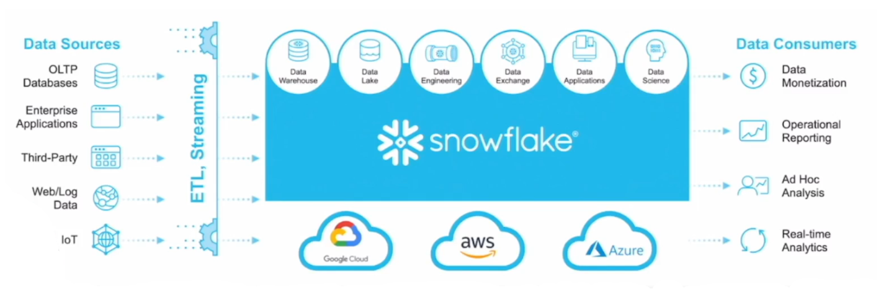
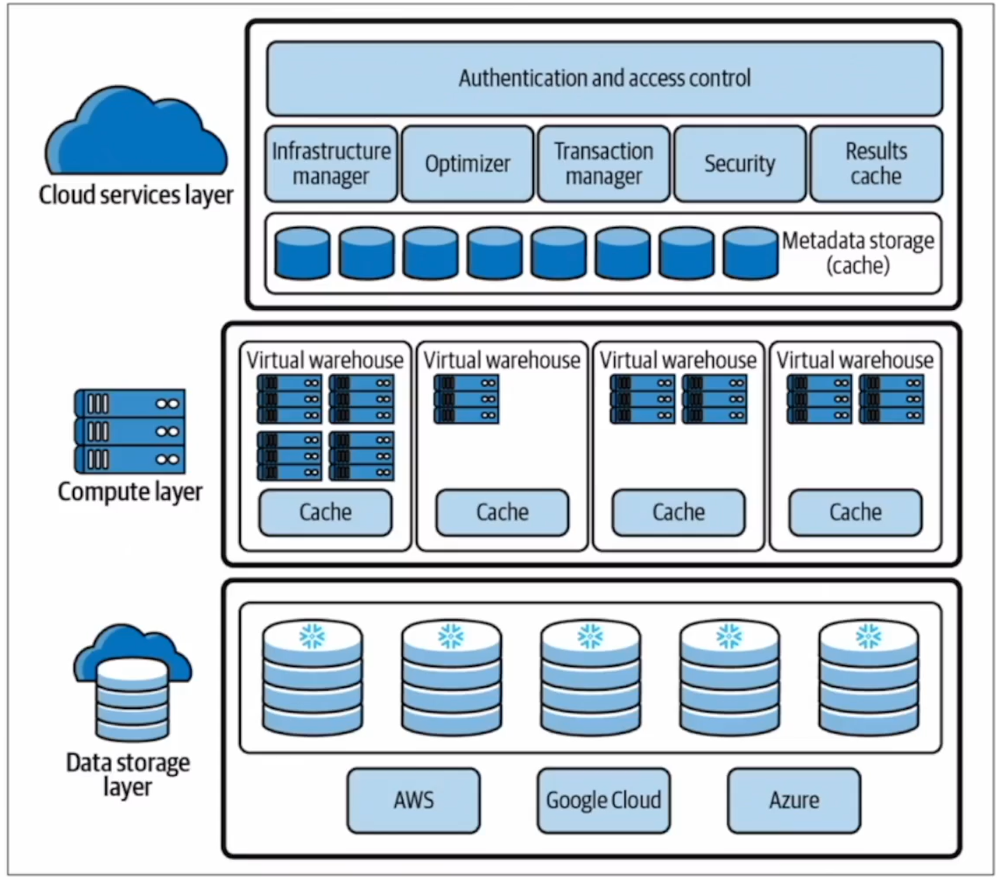

# Understanding Snowflake

- Snowflake is modern data warehouse tool.
- As shown in figure we have data coming from multiple sources, we have batch as well as streaming data
- It supports multiple functionality such you can build data warehouse, data lake, you can build entire data engineering pipeline, you can directly connect it to applications and also do the data science work on to the single data warehouse.
- It all of the different cloud providers (AWS, Azure, GCP)
- You can share the data to different consumers.

# Snowflake Architecture

