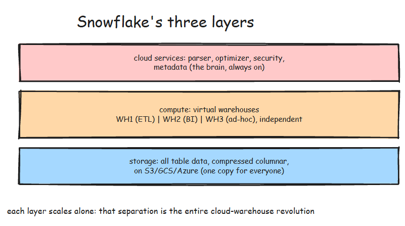
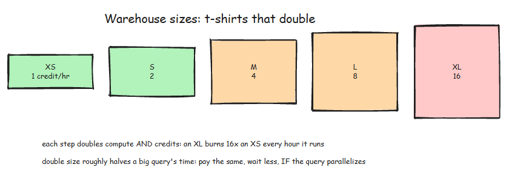

# Understanding Snowflake


- Snowflake is modern data warehouse tool.
- As shown in figure we have data coming from multiple sources, we have batch as well as streaming data
- It supports multiple functionality such you can build data warehouse, data lake, you can build entire data engineering pipeline, you can directly connect it to applications and also do the data science work on to the single data warehouse.
- It all of the different cloud providers (AWS, Azure, GCP)
- You can share the data to different consumers.

# Snowflake Architecture


- It mainly has Three layers.


## 1. Storage
- Storage holds every table as compressed, columnar micro-partitions in cloud object storage (S3, GCS, or Azure Blob). 
- There is exactly one copy of the data, and it belongs to no particular compute cluster. You pay flat object-storage rates for what you keep.

## 2. Compute

- Compute is where queries run, in clusters that Snowflake confusingly calls virtual warehouses.
- A warehouse is just an engine: it owns no data, it reads from the shared storage layer, and you can have many warehouses running against the same tables at the same time without touching each other.

## 3. Cloud Services
- Cloud services is the always-on brain: it parses SQL, plans queries, enforces permissions, and, most importantly, tracks metadata about every micro-partition.

# Virtual warehouses: t-shirt sizes that double
- Warehouses come in t-shirt sizes, and each size doubles both the compute and the cost:


```sql
CREATE WAREHOUSE MY_WH
WITH WAREHOUSE_SIZE = 'XSMALL'
AUTO_SUSPEND = 60
AUTO_RESUME = TRUE
INITIALLY_SUSPENDED = TRUE;
```
- Two properties of this design shape how teams work:
    - Resizing is trivial. `ALTER WAREHOUSE MY_WH SET WAREHOUSE_SIZE = 'LARGE'` takes effect in seconds. Sizing is a dial you turn per workload, not a purchase decision.
    - Warehouses are cheap to multiply. Because they share storage, giving ETL, BI, and ad-hoc analysis their own warehouses costs nothing extra when idle, and buys total isolation when busy.