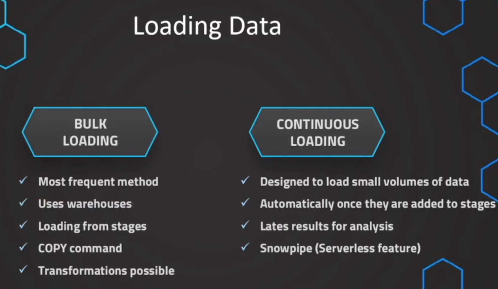
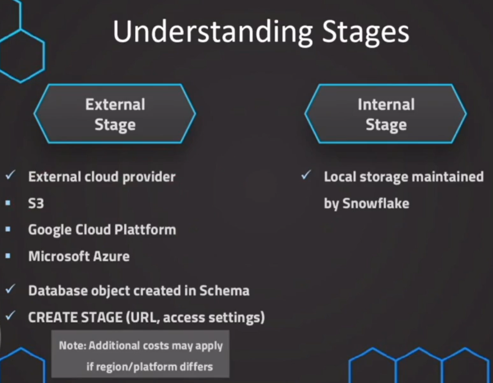
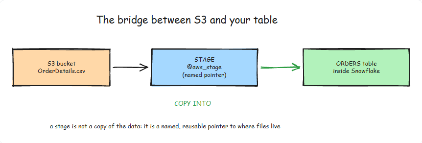

# Snowflake Stages and Data Loading

- One of the key features of Snowflake is the ability to load data from external sources into tables using stages and the COPY command. This is how data gets into your warehouse, whether from S3, Azure Blob Storage, or Google Cloud Storage.

 ## What are Stages in Snowflake

 - Stages are named locations that provide a way to access files from Snowflake. They act as a bridge between your external storage (like an S3 bucket) and your Snowflake tables.
 - There are two types:
    - Internal stages: Created and managed within Snowflake. Files are uploaded directly to Snowflake's internal storage.
    - External stages: Point to locations outside Snowflake (S3, GCS, Azure Blob). Snowflake reads files from these locations without moving them.